# Web Solution with WordPress

**Create a RedHat Instaance**

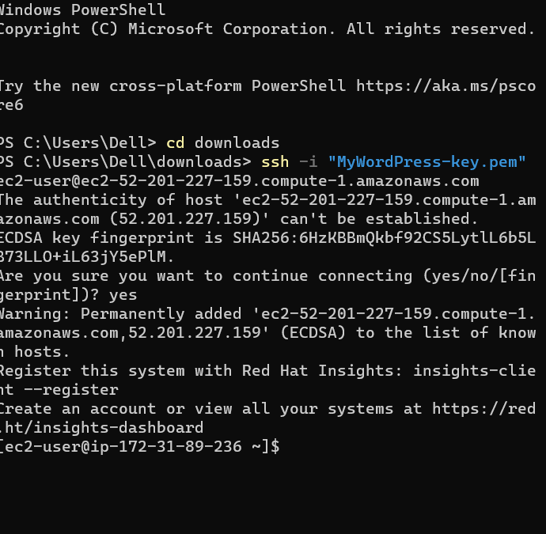

`ssh -i "MyWordPress-key.pem" ec2-user@ec2-52-201-227-159.compute-1.amazonaws.com`

-Set ec2-user as user

## Launch an EC2 Instance-Webserver

1.Prepare a Web Server
- [] Create 3 volumes in the same AZ(each of 10GiB)
- 

2.Confirm
`lsblk`

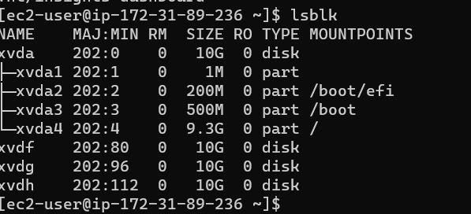

3.`df -h`

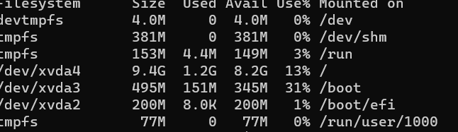

4.
-[]`sudo gdisk /dev/xvdf`
-[]`sudo gdisk /dev/xvdg`
-[]`sudo gdisk /dev/xvdh`
-[]type p
-[]next n with 8e00
-w
-y

-[]`lsblk`

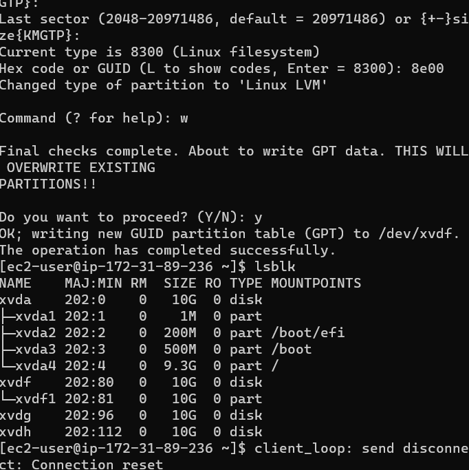

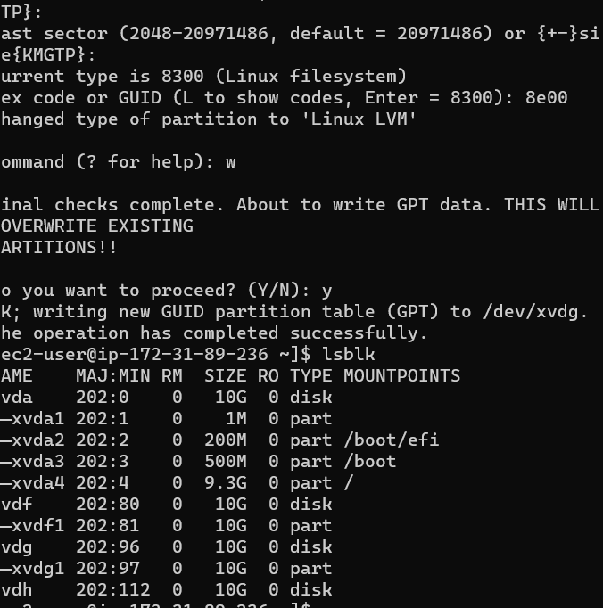

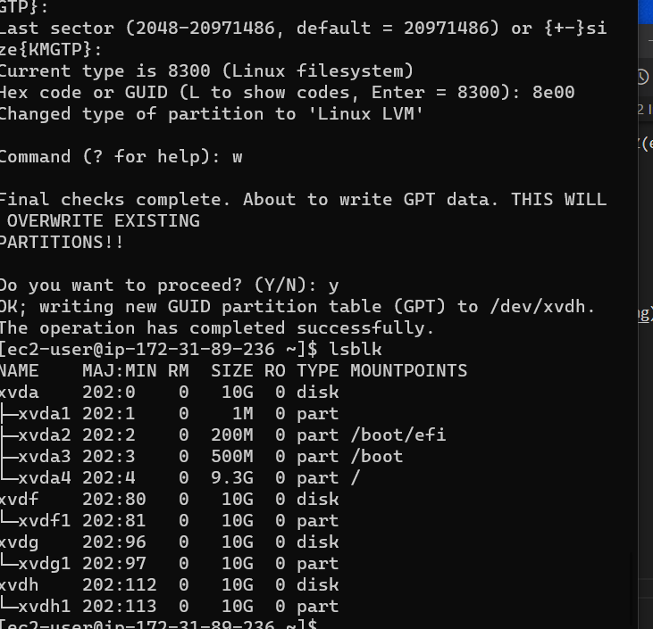

5.Install lvm2
[]`sudo yum install lvm2`

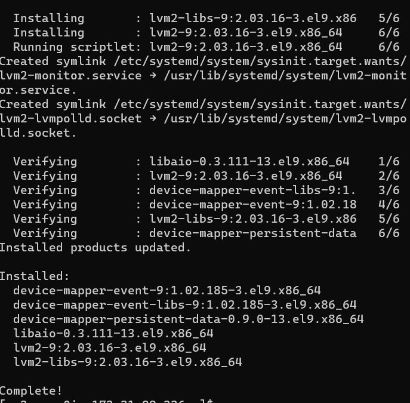

[]`sudo lvmdiskscan`

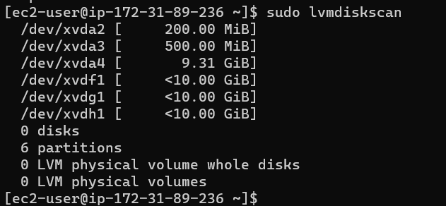

6.to mark as physical volumes
[]`sudo pvcreate /dev/xvdf1`
[]`sudo pvcreate /dev/xvdf1`
[]`sudo pvcreate /dev/xvdf1`

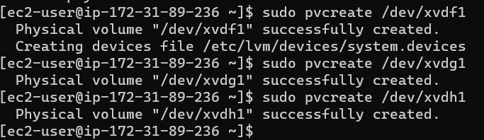

8.Verify
[]`sudo pvs`

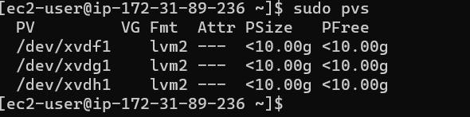

9. Add all 3 volumes to volume group VG webdata-vg
[]`sudo vgcreate webdata-vg /dev/xvdh1 /dev/xvdg1 /dev/xvdf1`

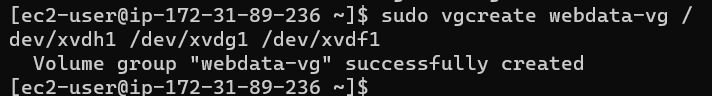

10.Verify
[]`sudo vgs`

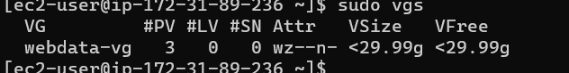

11.lvcreate utility to create 2 logical volumes(apps-lv and log-lv)
[]`sudo lvcreate -n apps-lv -L 14G webdata-vg`

[]`sudo lvcreate -n logslv -L 14G webdata-vg`

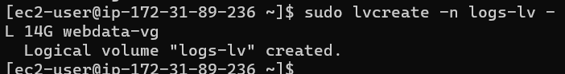

12.Confirm Logical volumes
[]`sudo lvs`

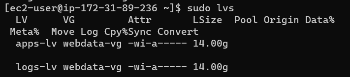

13.Verify entire setup
[]`sudo vgdisplay -v #view complete setup - VG, PV, and LV`

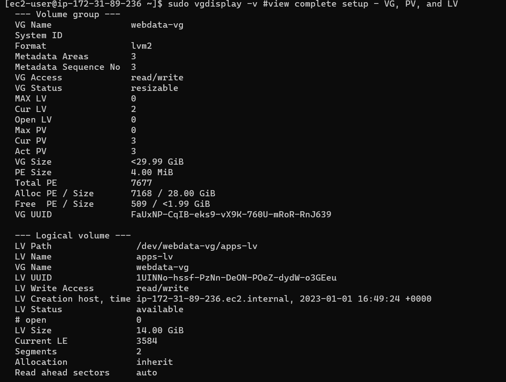

[]`sudo lsblk`

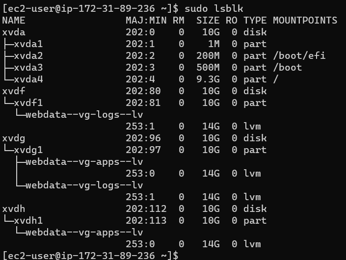

14.Format the LV with ext4 filesystem
[]`sudo mkfs -t ext4 /dev/webdata-vg/apps-lv`

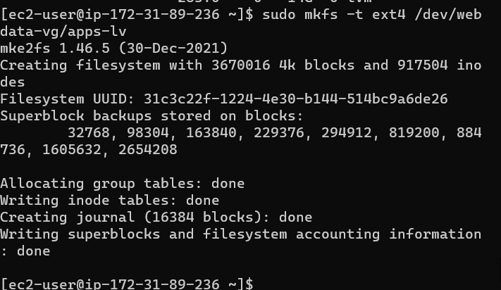

[]`sudo mkfs -t ext4 /dev/webdata-vg/logs-lv`

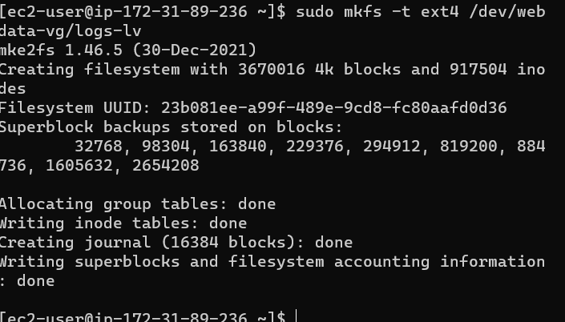

15.Create /var/www/html/ to store website files
[]`sudo mkdir -p /var/www/html`

16.Create /home/recovery/logs to store backup of log data
[]`sudo mkdir -p /home/recovery/logs`

17.Mount /var/www/html on apps-lv logical volume
[]`sudo mount /dev/webdata-vg/apps-lv /var/www/html/`

18.Back up all files in /var/log to /home/recovery/logs
[]`sudo rsync -av /var/log/. /home/recovery/logs/`

19.Mount /va/log on logs.Iv
[]`sudo mount /dev/webdata-vg/logs-lv /var/log`

20.Restore logs files back into /var/log/directory
[]`sudo rsync -av /home/recovery/logs/. /var/log`

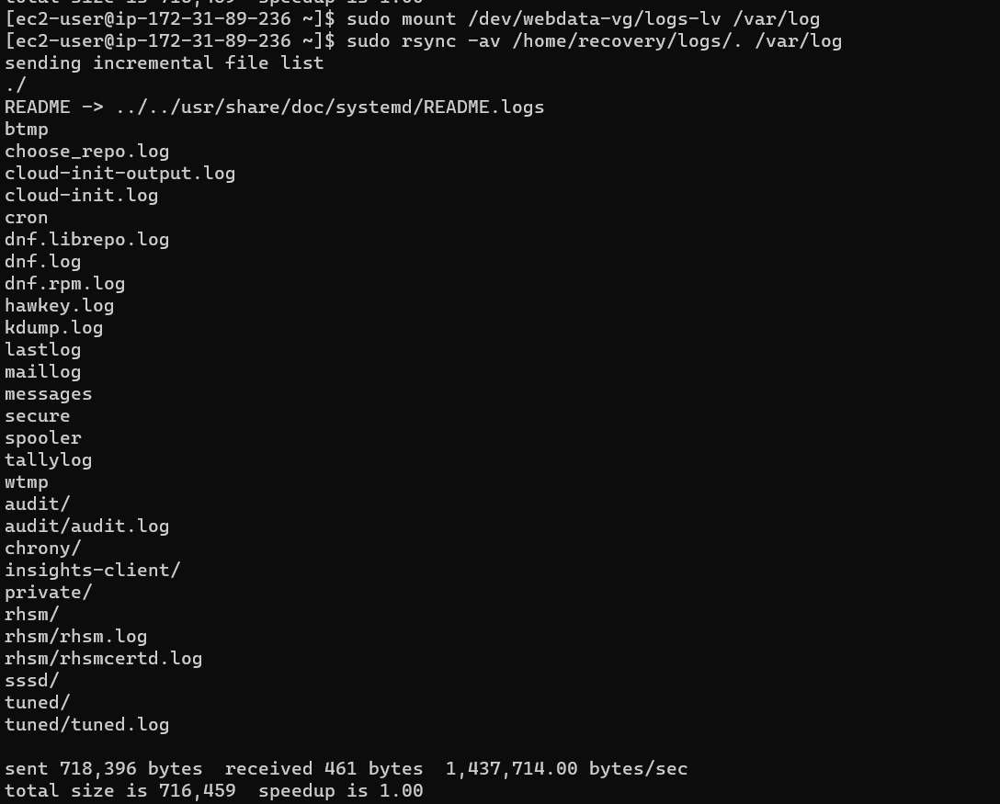

21.Update /etc/fstab file so that the mount configuration will persist after restart of the server
[]`sudo blkid`

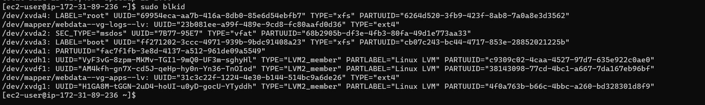

[]`sudo vi /etc/fstab`

- Include 
>UUID=23b081ee-a99f-489e-9cd8-fc80aafd0d36 /var/log ext4 defaults 0 0
UUID=31c3c22f-1224-4e30-b144-514bc9a6de26 /var/www/html ext4 defaults 0 0

### Step 1

1.Test the configuration and reload the daemon
`sudo mount -a`
`sudo systemctl daemon-reload`

2.Verify setup
`df -h`

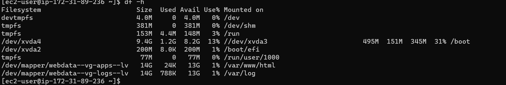

### Step 2

**Create a RedHat-DB Instaance**

`ssh -i "MyWordPress-key.pem" ec2-user@ec2-54-210-11-143.compute-1.amazonaws.com`

-Set ec2-user as user

## Launch an EC2 Instance-Webserver

1.Prepare a Web Server
-Create 3 volumes in the same AZ(each of 10GiB)

3.Confirm
`lsblk`

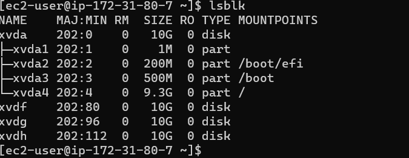

4.`df -h`

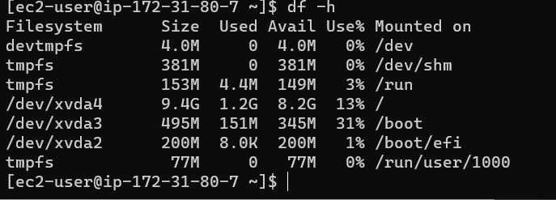

5.`sudo gdisk /dev/xvdf`
`sudo gdisk /dev/xvdg`
`sudo gdisk /dev/xvdh`
-type p
-next n with 8e00
-w
-y

`lsblk`

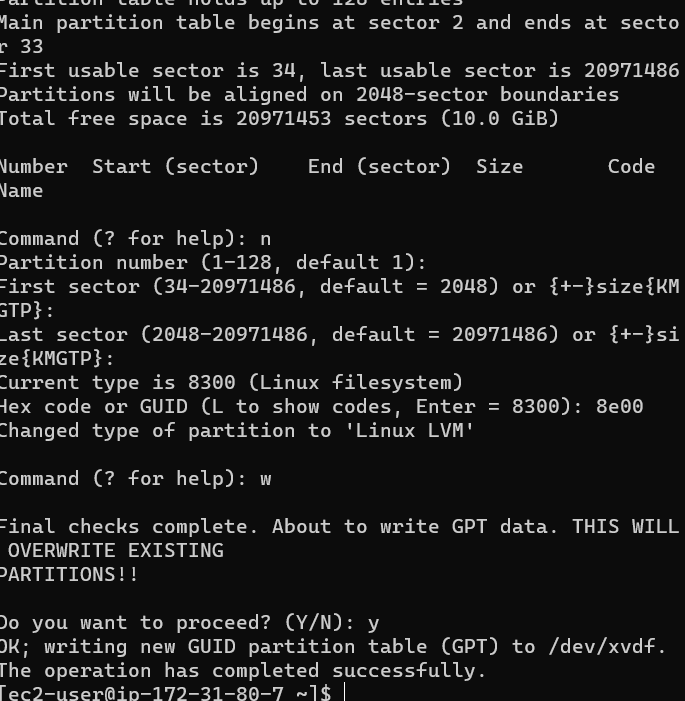

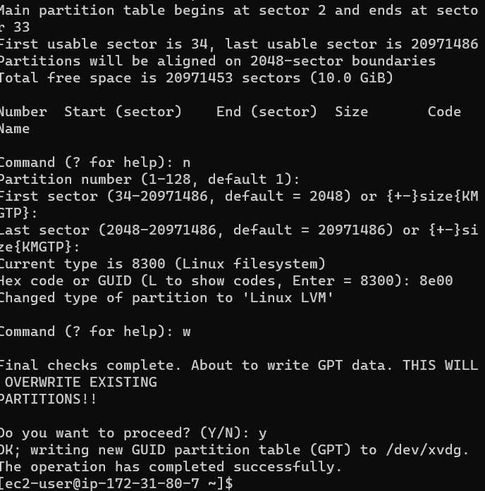

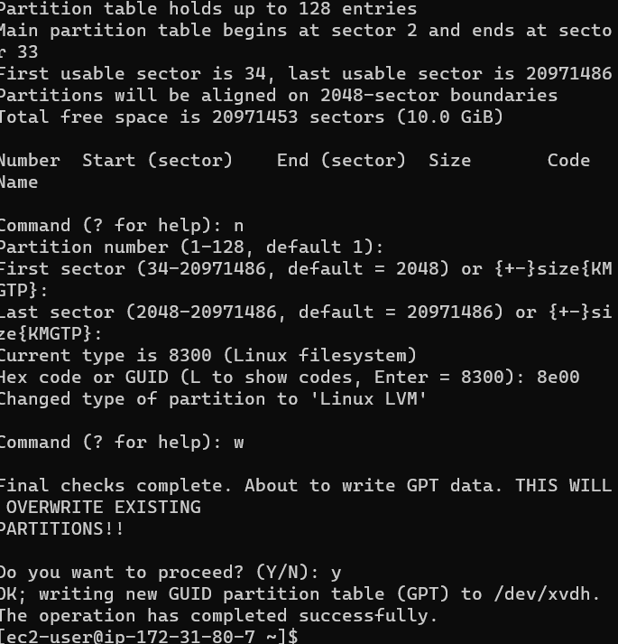

6.Install lvm2
`sudo yum install lvm2`

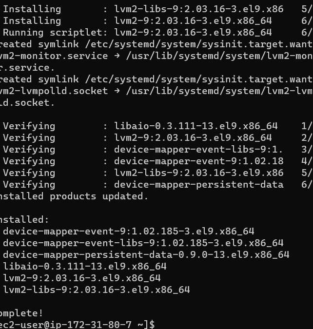

`sudo lvmdiskscan`

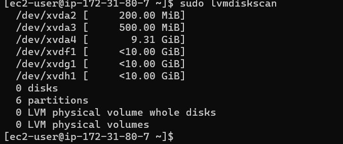

7.to mark as physical volumes
`sudo pvcreate /dev/xvdf1`
`sudo pvcreate /dev/xvdf1`
`sudo pvcreate /dev/xvdf1`

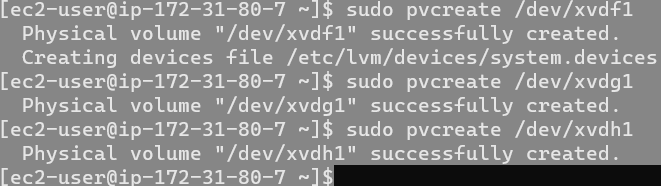

8.Verify
`sudo pvs`

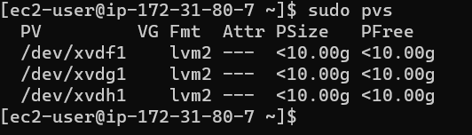

9.Add all 3 volumes to volume group VG webdata-vg
`sudo vgcreate webdata-vg /dev/xvdh1 /dev/xvdg1 /dev/xvdf1`

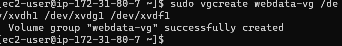

10.Verify
`sudo vgs`
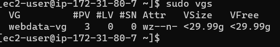

11.lvcreate utility to create 2 logical volumes(db-lv and log-lv)
`sudo lvcreate -n db-lv -L 14G webdata-vg`

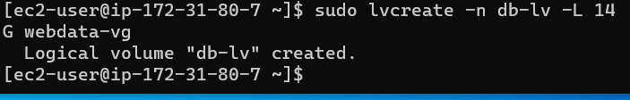

`sudo lvcreate -n logs-lv -L 14G webdata-vg`

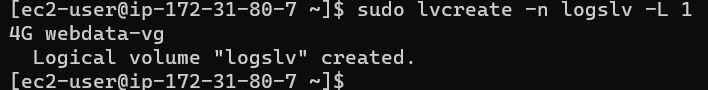

**Blocker to rename /dev/webdata-vg/logslv to /dev/webdata-vg/logs-lv
`sudo lvrename /dev/webdata-vg/logslv /dev/webdata-vg/logs-lv`

12.Confirm Logical volumes
`sudo lvs`

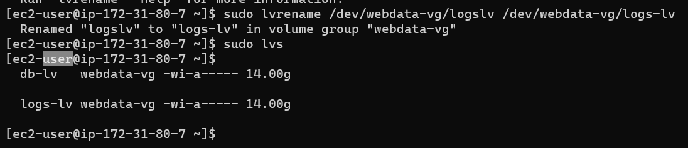

13.Verify entire setup
`sudo vgdisplay -v #view complete setup - VG, PV, and LV`

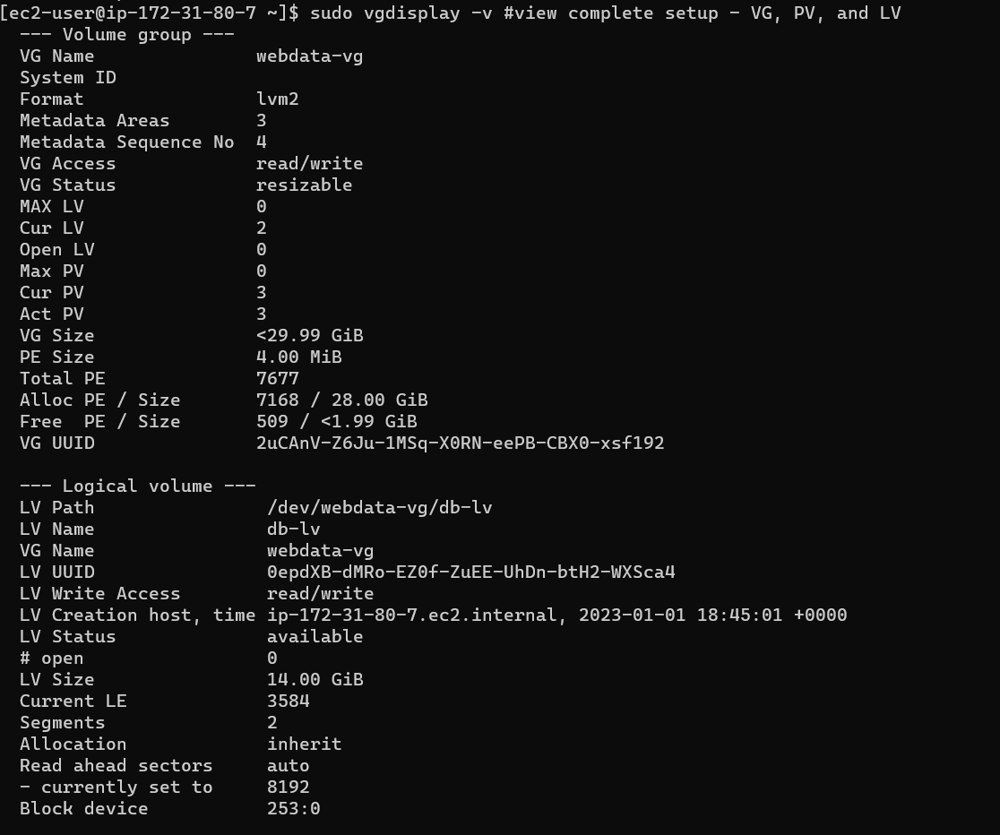

`sudo lsblk`

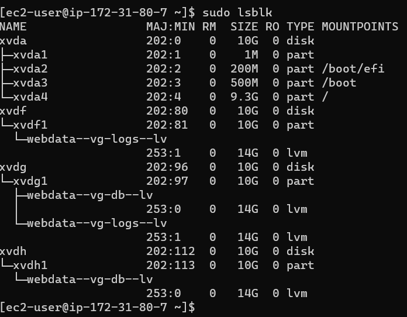

14.Format the LV with ext4 filesystem
[]`sudo mkfs -t ext4 /dev/webdata-vg/db-lv`

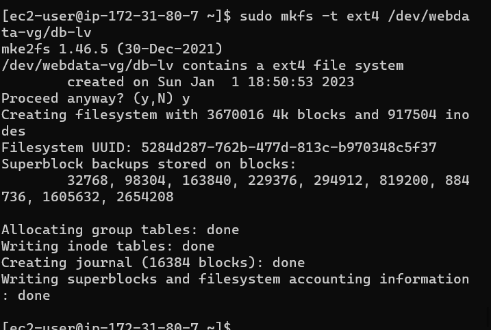

[]`sudo mkfs -t ext4 /dev/webdata-vg/logs-lv`

15.Create /db to store website files
`sudo mkdir -p /db`

16.Create /home/recovery/logs to store backup of log data
`sudo mkdir -p /home/recovery/logs`

17.Mount /db on db-lv logical volume
`sudo mount /dev/webdata-vg/db-lv /db`

18.Back up all files in /var/log to /home/recovery/logs
`sudo rsync -av /var/log/. /home/recovery/logs/`

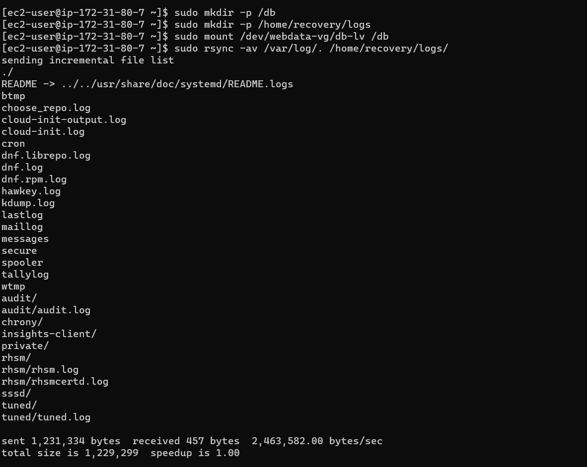

19.Mount /va/log on logs.Iv
`sudo mount /dev/webdata-vg/logs-lv /var/log`

20.Restore logs files back into /var/log/directory
`sudo rsync -av /home/recovery/logs/. /var/log`

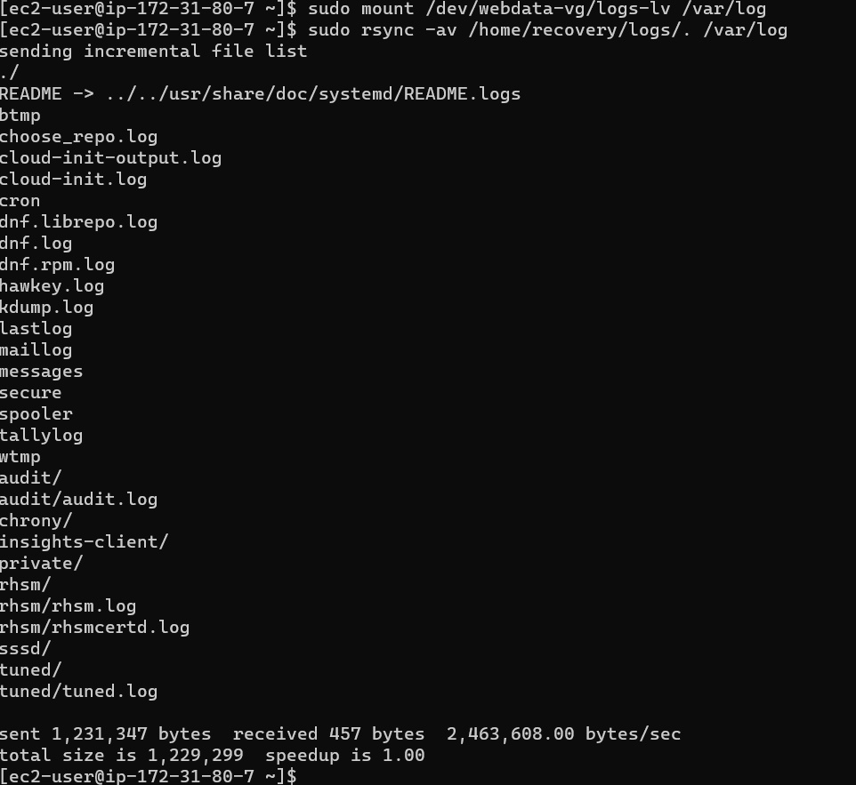

21.Update /etc/fstab file so that the mount configuration will persist after restart of the server
`sudo blkid`

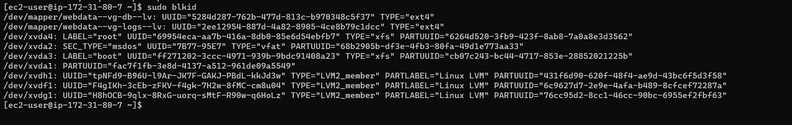

`sudo vi /etc/fstab`

- Include 
>UUID=2ee12954-887d-4a82-8905-4ce8b79c1dcc /var/log ext4 defaults 0 0
UUID=5284d287-762b-477d-813c-b970348c5f37 /db ext4 defaults 0 0

### continue

1.Test the configuration and reload the daemon
`sudo mount -a`
`sudo systemctl daemon-reload`

2.Verify setup
`df -h`

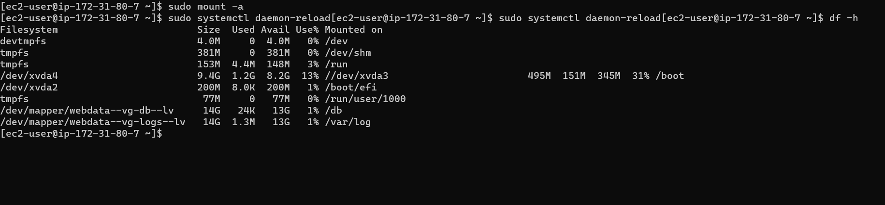

### Step 3- Web Server

1.update 
`sudo yum -y update`

2.Install wget, apache and its dependencies
`sudo yum -y install wget httpd php php-mysqlnd php-fpm php-json`

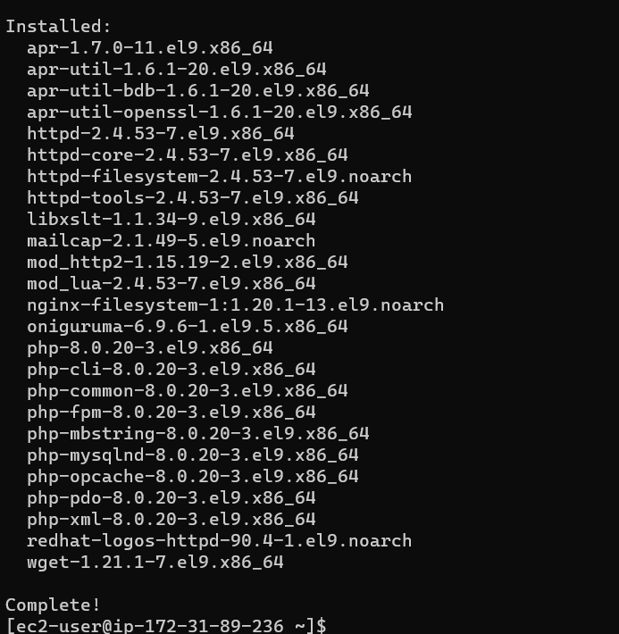

3.Start Apache
 `sudo systemctl enable httpd`
`sudo systemctl start httpd`

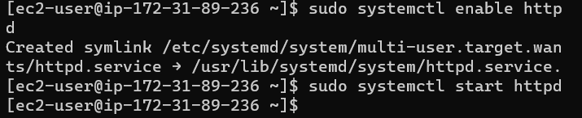

4.Install PHP and it’s depemdencies
`sudo yum install https://dl.fedoraproject.org/pub/epel/epel-release-latest-8.noarch.rpm`

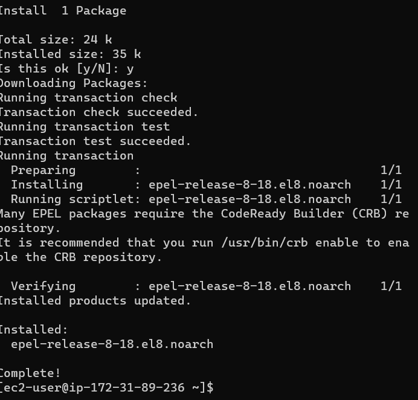

`sudo yum install yum-utils http://rpms.remirepo.net/enterprise/remi-release-8.rpm`

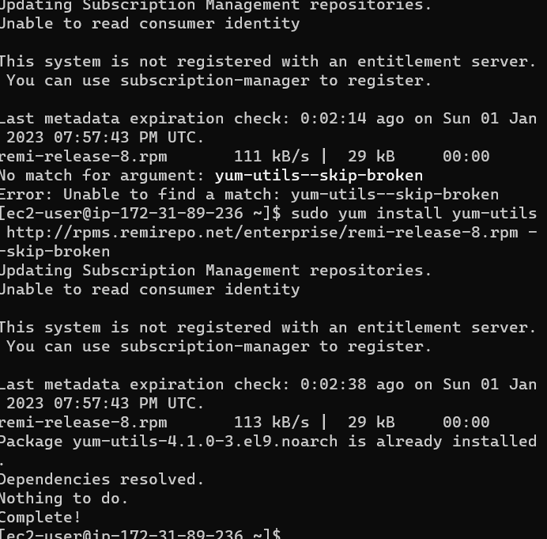

`sudo yum module reset php`
`sudo yum module enable php:remi-7.4`
`sudo yum install php php-opcache php-gd php-curl php-mysqlnd`

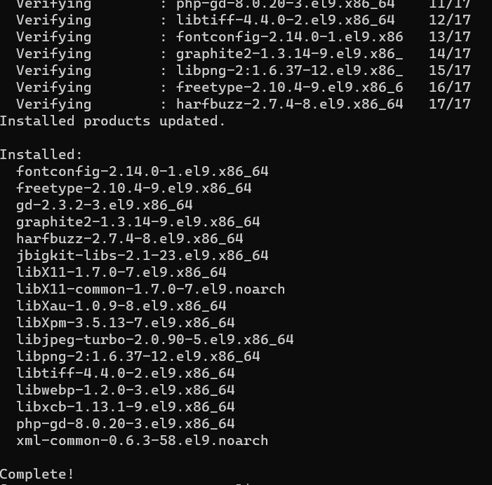

`sudo systemctl enable php-fpm`
`setsebool -P httpd_execmem 1`

![setsebool]](./Images/setsebool.png)

5.Restart Apache
`sudo systemctl restart httpd

6.Download wordpress and copy word press to
var/www/html
`mkdir wordpress`
`cd   wordpress`
`sudo wget http://wordpress.org/latest.tar.gz`

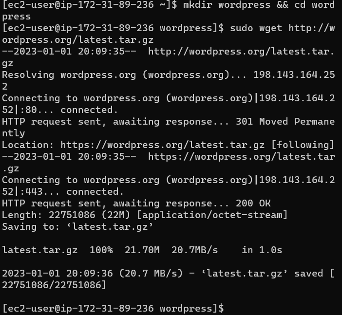

`sudo tar xzvf latest.tar.gz`
`sudo rm -rf latest.tar.gz`
`sudo cp wordpress/wp-config-sample.php wordpress/wp-config.php`
`sudo cp -R wordpress /var/www/html/`

7.Configure SELinux Policies
`sudo chown -R apache:apache /var/www/html/wordpress`
`sudo chcon -t httpd_sys_rw_content_t /var/www/html/wordpress -R`
`sudo setsebool -P httpd_can_network_connect=1`

### Step 4-Install MySQL on your DB server

`sudo yum update
`sudo yum install mysql-server

-Verify
`sudo systemctl restart mysqld`
`sudo systemctl enable mysqld`

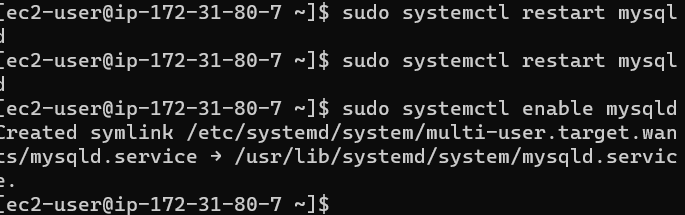

### Step 5- configure DB to work with wordpress

`sudo mysql`
>CREATE DATABASE wordpress;`
CREATE USER `myuser`@`<Web-Server-Private-IP-Address>` IDENTIFIED BY 'mypass';

GRANT ALL ON wordpress.* TO 'myuser'@'172.31.89.236';

FLUSH PRIVILEGES;

SHOW DATABASES;
exit

-Configure MySQL server to allow connections from remote hosts
`sudo vi /etc/my.cnf/mysql.conf.d/mysqld.cnf`
`sudo vi /etc/my.cnf.d`
- Replace '127.0.0.1' to '0.0.0.0'
bind-address    =0.0.0.0

`sudo vi wp-config.php`
<?php

define( 'DB_NAME', 'wordpress');
define( 'DB_USER', 'myuser');
define( 'DB_PASSWORD', 'mypass');
define( 'DB_HOST','172.31.80.7');
define( 'DB_CHARSET', 'utf8');
?>

-disable the Apache otherwise the site won't be visible
`sudo systemctl disable httpd `

### Step 6-Configure Wordpress to connect to remote database
 
`sudo systemctl restart mysqld`

`sudo yum install mysql`

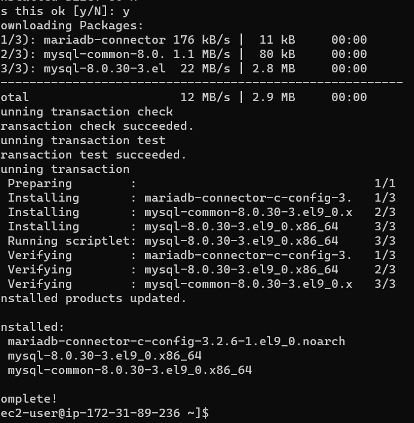

sudo mysql -u myuser -p -h 172.31.80.7

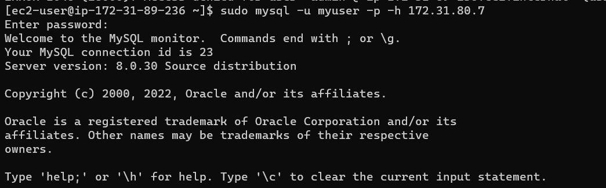

`show databases;`

###Configuring wp-config.php
`sudo wget https://wordpress.org/latest.tar.gz`
`sudo tar -xvf latest.tar.gz`
`sudo cp wordpress/wp-config-sample.php wordpress/wp-config.php`
`sudo vi wordpress/wp-config.php`

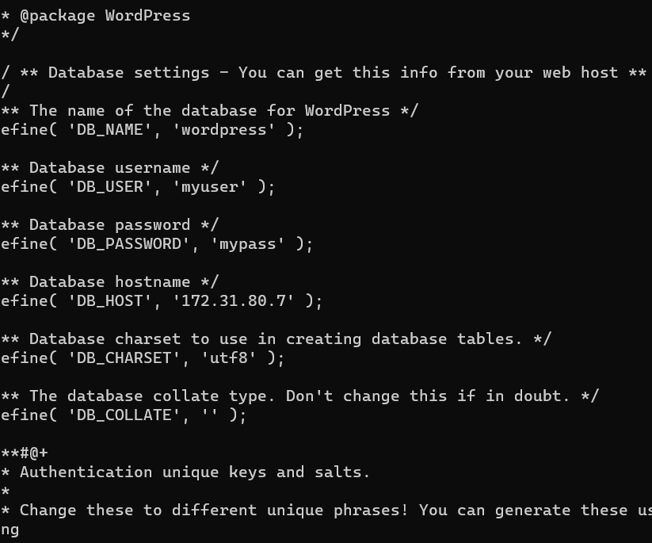

- copy
`sudo cp -R wordpress /var/www/html/`
-assign permissions
`sudo chown -R apache:apache /var/www/html/wordpress`
`sudo chcon -t httpd_sys_rw_content_t /var/www/html/wordpress -R`
`sudo chmod -Rf 775  /var/www/html`
`sudo vi /etc/httpd/conf.d/wordpress.conf`
-copy and paste
<VirtualHost *:80>
ServerAdmin myuser@18.204.218.183
DocumentRoot /var/www/html/wordpress

<Directory "/var/www/html/wordpress">
Options Indexes FollowSymLinks
AllowOverride all
Require all granted
</Directory>

ErrorLog /var/log/httpd/wordpress_error.log
CustomLog /var/log/httpd/wordpress_access.log common
</VirtualHost>

---
-restart
`sudo systemctl restart httpd`

Blocker found -unable to load address on browser

[Link to Wordpress](http://3.95.147.104/wordpress/)
